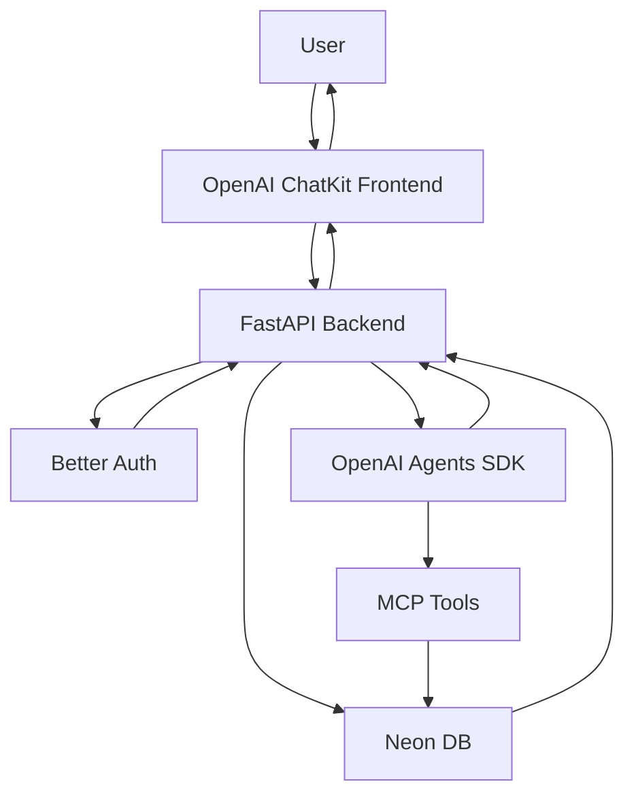

# System Architecture Specification: Stateless Todo AI Chatbot

## Overview
This document outlines the architecture for a stateless todo AI chatbot that manages tasks through natural language processing. The system follows a microservices architecture with clear separation of concerns between frontend, backend, AI logic, and data persistence layers.

## Architecture Components

### 1. Frontend Layer
- **Technology**: OpenAI ChatKit
- **Responsibility**: User interface for interacting with the AI chatbot
- **Features**:
  - Real-time chat interface
  - Message history display
  - Natural language input processing
  - Domain allowlisting compliance

### 2. Backend Layer
- **Technology**: Python FastAPI
- **Responsibility**: API gateway and business logic orchestration
- **Characteristics**:
  - Stateless design (no in-memory state storage)
  - All data persisted to Neon DB
  - RESTful API endpoints
  - Authentication via Better Auth

### 3. AI Logic Layer
- **Technology**: OpenAI Agents SDK
- **Responsibility**: Natural language understanding and task processing
- **Features**:
  - Intent recognition for task operations
  - Natural language processing for user requests
  - Tool integration for database operations

### 4. Protocol Layer
- **Technology**: Official MCP SDK
- **Responsibility**: Standardized tool communication
- **Features**:
  - Exposes task operations as standardized tools
  - Ensures interoperability between components

### 5. Database Layer
- **Technology**: Neon Serverless PostgreSQL with SQLModel ORM
- **Responsibility**: Persistent data storage
- **Models**:
  - Tasks: Individual todo items with status, priority, and metadata
  - Conversations: Chat session containers
  - Messages: Individual chat messages within conversations

### 6. Authentication Layer
- **Technology**: Better Auth
- **Responsibility**: User authentication and authorization
- **Features**:
  - Secure user identification
  - Session management
  - Access control for user-specific data

## API Endpoints

### Chat Endpoint
```
POST /api/{user_id}/chat
```
- **Purpose**: Process user chat messages and return AI responses
- **Parameters**: user_id (path), message (body)
- **Statelessness**: All conversation context retrieved from database
- **Response**: AI-generated response with any side effects (task operations)

## Data Models

### Task Model
- id: Unique identifier
- user_id: Owner of the task
- title: Task description
- status: Pending, Completed, Archived
- priority: Low, Medium, High
- created_at: Timestamp
- updated_at: Timestamp
- due_date: Optional deadline

### Conversation Model
- id: Unique identifier
- user_id: Owner of the conversation
- title: Conversation summary
- created_at: Timestamp
- updated_at: Timestamp

### Message Model
- id: Unique identifier
- conversation_id: Parent conversation
- sender: User or Assistant
- content: Message text
- timestamp: When message was sent

## Flow Diagram



## Security Considerations
- All API endpoints require authentication
- Database connections use encrypted transport
- User data is isolated by user_id
- Input validation on all endpoints

## Scalability Features
- Serverless database handles variable load
- Stateless backend enables horizontal scaling
- Caching strategies for improved performance
- Load balancing for multiple backend instances

## Error Handling
- Comprehensive error logging
- Graceful degradation for service outages
- User-friendly error messages
- Retry mechanisms for transient failures